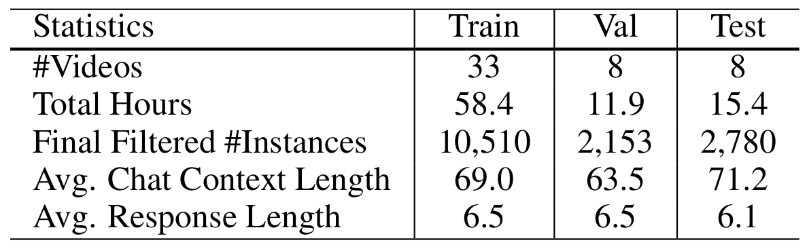

# Game-Based Video-Context Dialogue
This repository contains Twitch-FIFA dataset and code for: [Game-Based Video-Context Dialogue](https://arxiv.org/abs/1809.04560)

Twitch-FIFA dataset is collected from [twitch.tv](https://www.twitch.tv) platform and is subject to research-only purposes in accordance with the Twitch [privacy policy](https://www.twitch.tv/p/legal/privacy-policy/). Note that the included MIT license only applies to our code and models. 

## Twitch-FIFA Dataset Download - Google Drive 
* You can download the full processed dataset along with inception-v3 frame-level videos features from [here](https://drive.google.com/open?id=1S52myy-5qde2jFmrU2mizJIs9FmN-gE6).
* You can download the raw videos at 3fps from [here](https://drive.google.com/drive/folders/11VE_uDByvF5AkVD8QEoU5VlDlRGmsDv1?usp=sharing).

Dataset Statistics:

## Code and Models
* COMING SOON! 

## Citation
If you find this dataset and code helpful, please consider citing the following paper:

    @inproceedings{pasunuru2018gamebased,
        title={Game-Based Video-Context Dialogue},
        author={Pasunuru, Ramakanth and Bansal, Mohit},
        booktitle={EMNLP},
        year={2018}
    }
  
